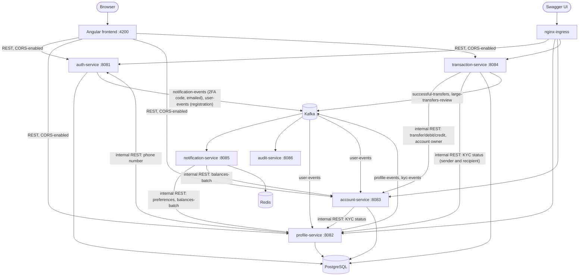

# Banking App — Microservices Platform

A Spring Boot microservices banking backend covering identity & 2FA, KYC, account management, internal/external transfers with fraud review, and event-driven notifications — built end-to-end from a real functional-requirements spec (see [Built from a real spec](#built-from-a-real-spec) below), not a toy CRUD demo.

## Architecture



`account-service` is the sole owner of the `accounts`/`transactions` tables (the balance ledger and dashboard history) — every other service that needs to move money or read balances goes through its internal API (`/api/v1/internal/**`) rather than touching those tables directly. `transaction-service` now keeps its own `wire_transactions` table for tracking external wire transfer status and fraud-review state, so the two services no longer share a table between them — `transaction-service` just calls `account-service`'s internal API to actually debit/credit an account once a wire clears.

`notification-service`'s internal Feign clients default to `localhost` (`:8083` for account-service, `:8082` for profile-service) so the whole stack works out of the box locally; the k8s `prod` profile overrides these via `PROFILE_SERVICE_URL`/`ACCOUNT_SERVICE_URL` env vars to reach the in-cluster service names instead.

## Tech stack

**Backend**
- **Java 17 / Spring Boot 3.3** — Spring Web, Spring Security (OAuth2 Resource Server), Spring Data JPA, Spring AOP, Spring Kafka, Spring Cache (Redis), OpenFeign
- **PostgreSQL 15** (Flyway migrations), **Apache Kafka** (KRaft mode, no ZooKeeper), **Redis 7**
- **JWT** (HS256, shared HMAC secret) — short-lived Full-Auth tokens, scoped Pre-Auth tokens for in-progress 2FA
- **JUnit 5 / Mockito / MockMvc / AssertJ** — every service has a full acceptance-test suite
- **Terraform** (AWS VPC/RDS/EKS) + **Helm** (Kafka/Redis/ingress-nginx) + **Kubernetes manifests** + **Docker** + **GitHub Actions** CI/CD

**Frontend** (`frontend/`)
- **Angular 22** (standalone components, signal-based state), **TypeScript**, plain CSS
- **Karma / Jasmine** for unit tests, **Cypress** for end-to-end tests
- JWT bearer auth with an HTTP interceptor (silent refresh-and-retry on 401), route guards on every authenticated page

## Built from a real spec

This system was implemented against 10 functional-requirement documents (FR1–FR10, covering 2FA, session management, KYC, profile updates, account overview, transaction history, internal/external transfers, and notifications) — not built ad hoc. Nearly every controller and service method carries a `FR#.# AC#` comment tracing it back to the specific user story and acceptance criterion it satisfies, so the spec-to-code mapping is auditable directly in the source.

## Services

| Service | Port | Responsibility |
|---|---|---|
| `01-auth-service` | 8081 | Login, registration, device fingerprinting, TOTP/emailed-code 2FA, refresh/logout, JWT issuance — sole owner of both contact columns, including the email address 2FA codes are sent to |
| `02-profile-service` | 8082 | KYC verification/webhook/admin override, identity & contact info, alert & daily-summary preferences; provisions a profile on registration |
| `03-account-service` | 8083 | Account dashboard, paginated transaction history, self-service open-account/add-funds — sole owner of the accounts ledger; provisions a starter account on registration |
| `03-transaction-service` | 8084 | Internal transfers, external wires, fraud-threshold review |
| `04-notification-service` | 8085 | Kafka-driven 2FA codes and real-time alerts + scheduled daily balance summary; real email delivery via SendGrid (dormant Twilio/TextBelt SMS clients still selectable); exposes `/api/v1/notifications` |
| `05-audit-service` | 8086 | Immutable, insert-only audit log of profile/KYC changes (no REST API) |
| `frontend` | 4200 | Angular web client — login/2FA, dashboard, transactions, transfers, history, notifications, profile, alert preferences |

## Frontend

`frontend/` is an Angular 22 single-page app that talks to `auth-service`, `profile-service`, `account-service`, `transaction-service`, and `notification-service` directly over REST (`audit-service` has no REST API, so the frontend never calls it). Each of those services has a `CorsConfigurationSource` bean scoped to `http://localhost:4200` with credentials enabled, since the frontend and backend run on different ports locally.

**Pages:** `/signup` (self-service registration) → `/login` (credentials + emailed 2FA code) → `/dashboard` (account list, plus opening a further account and adding funds — both KYC-gated) → `/accounts/:id/transactions` (paginated history) → `/transfer` (own-account transfers, paying another user by account number, and external wire — all KYC-gated) → `/history` (ledger entries and wires merged, filterable) → `/notifications` (delivered alert log) → `/profile` (identity verification, KYC status, account number/IBAN/SWIFT to receive money) → `/profile/alerts` (threshold + daily summary).

**Registration provisioning:** `POST /api/v1/auth/register` (or the `/signup` page) creates the auth-service credentials, then publishes a `user-events` Kafka event that `profile-service` and `account-service` each consume independently to provision their own initial row — a `PENDING_VERIFICATION` profile and a `$0` `CHECKING` account — so a freshly-registered user has a usable (if empty) dashboard and KYC status immediately, no manual seeding required. That starter account comes from the Kafka listener, not the self-service open-account path, so it is deliberately outside the KYC gate — otherwise a brand-new user would be verified-gated out of the very account they need in order to get verified. See [Identity verification (KYC)](#identity-verification-kyc) below for how a user gets verified so the rest unlocks.

Registration rejects a username, email address or phone number already registered to somebody else with a `409`; all three are unique columns on `users`. The email check is the one now carrying the security weight, because the address is what receives that account's 2FA codes — letting two users share one hands the second of them the keys to the first one's login. The phone number stays unique too: it is still the account's contact number and the fallback destination if SMS delivery is ever switched back on, and a shared number would put us straight back in that position.

## Running this project

**Prerequisites:** Docker Desktop running, Java 17 (JDK), and ports `5432`, `9092`, `6379`, and `8081`-`8086` free. No `.env` file or secrets setup needed — each service's `application.yml` already has dev-profile defaults that match `docker-compose.yml`, so this runs with zero configuration.

**1. Clone and start the infra stack** (Postgres, Kafka in KRaft mode, Redis) from the repo root:

```bash
git clone <this-repo-url>
cd my-banking-project
docker-compose up -d
```

**2. Start each service**, one per terminal, from that service's own directory (Windows: use `mvnw.cmd spring-boot:run` instead of `./mvnw spring-boot:run`):

| # | Directory | Command | Port |
|---|---|---|---|
| 1 | `01-auth-service` | `./mvnw spring-boot:run` | 8081 |
| 2 | `02-profile-service` | `./mvnw spring-boot:run` | 8082 |
| 3 | `03-account-service` | `./mvnw spring-boot:run` | 8083 |
| 4 | `03-transaction-service` | `./mvnw spring-boot:run` | 8084 |
| 5 | `04-notification-service` | `./mvnw spring-boot:run` | 8085 |
| 6 | `05-audit-service` | `./mvnw spring-boot:run` | 8086 |

`transaction-service` and `notification-service` call `account-service`/`profile-service` internally, so it's cleanest to start those two first — but since those are just REST calls, starting all six in any order works too as long as they're all up before you exercise the API.

**3. Verify it's working** — open any of the Swagger UIs below and try an endpoint (e.g. `POST /api/v1/auth/login` on the auth-service docs).

**4. Run the backend tests** for any service:

```bash
./mvnw test                    # run from inside any one service's directory
```

**5. Create a test user** — register via `POST /api/v1/auth/register` (or the frontend's `/signup` page) with `{"username", "password", "phoneNumber", "email"}`. This is the preferred path: it also publishes the `user-events` Kafka event that provisions a `PENDING_VERIFICATION` profile and a `$0` checking account (with its own IBAN) automatically (see [Frontend](#frontend) above) — `auth-service`, `profile-service`, and `account-service` all need to be running for that to happen. Give each test user a distinct email address and phone number: usernames, emails and phone numbers are all unique, so reusing either from an earlier test user comes back as a `409` rather than creating the account. The email matters most — it is where that user's 2FA codes go.

If you'd rather skip the API and insert a user directly into Postgres (bcrypt hash below is for password `Password123!`), note that this bypasses the `user-events` publish entirely — you'll need to seed `user_profiles`/`accounts` rows yourself too:

```bash
docker exec banking-postgres-local psql -U dbadmin -d banking -c "
INSERT INTO users (username, password, phone_number, email, totp_enabled)
VALUES ('e2etest', '\$2b\$10\$FQ/4MWYZrC9XB.zJl1TFuemdJY2lMP7hFzpdHAkweAHHhZP2UBKme', '+15551234567', 'e2etest@example.com', false);
"
```

Fill in `email` even for a throwaway user — it is the column 2FA codes are delivered to, and leaving it null means no code can be produced for that user at all, so a pre-seeded recognized device is the only way to log them in.

Either way, KYC starts out `PENDING_VERIFICATION`, and transfers, opening a further account and adding funds are all gated on it — fill in the verification form on `/profile` to get approved (see [Identity verification (KYC)](#identity-verification-kyc)), or update `user_profiles` directly. The starter account itself arrives regardless, so an unverified user still has something to look at. To test paying another user you need **two** verified users: the recipient's own verification is checked as well as the sender's.

**Getting past 2FA locally.** First login from a new browser is a 2FA challenge, and the code is emailed rather than texted: `auth-service` mints it, publishes it on `notification-events`, and `notification-service` delivers it to the address on the user's `users` row. The code is never handed back over the API — the `202` from `POST /api/v1/auth/login` carries only `{"status": "2FA_REQUIRED", "pre_auth_token": "...", "expires_in_seconds": 180}` — so getting in locally means actually reading the code somewhere. Two ways, easiest first:

1. **Read it out of the log (recommended).** With `notification-service` running and `email.provider` left at its `logging` default, the code is written to that service's console instead of being mailed. No credentials, no mailbox, and you get to watch the whole Kafka path run. It does mean `notification-service` and Kafka have to be up: there is no longer a shortcut that skips them.
2. **Skip 2FA altogether.** Insert a `recognized_devices` row for that user (`device_hash` = base64(SHA-256(raw-device-id))) and send that raw value as a `Device-ID` cookie on login. Handy for scripted/E2E runs where you don't want a challenge at all.

**The code expires, and the login screen says so.** A code is good for three minutes — `application.security.two-factor.code-ttl-seconds` in `auth-service`, default `180`. That one number is the row's `expires_at`, the `expires_in_seconds` the API returns, and the value that rides along on the Kafka event so the email and the on-screen countdown agree. The 2FA screen counts down from it and, at `0:00`, swaps in a **Resend** button: `POST /api/v1/auth/verify-2fa/resend` mints a fresh code and reissues the pre-auth token, since the original is only good for five minutes and a user waiting on a second code would otherwise end up holding a live code and a dead session. Resending within 30 seconds of the current code is a `429` with `retry_after_seconds`. Submitting a lapsed code is a `410`, distinct from the `401` a simply wrong one gets, so the screen can tell the user to request a new code rather than to retype the old one.

**Sending a real email locally.** Register the test user with an address you can actually read, then point `email.provider` at `sendgrid` and supply the key (see [Notification providers](#notification-providers) for the variables and the safety notes). One wrinkle worth stating plainly: Spring Boot does **not** read `.env` — filling that file in and running `./mvnw spring-boot:run` changes nothing, and the service quietly keeps logging instead of sending. The variables have to be in the shell's own environment first:

```bash
# Git Bash / macOS / Linux, from the repo root
set -a && source .env && set +a
cd 04-notification-service && ./mvnw spring-boot:run
```

The PowerShell equivalent is in [Notification providers](#notification-providers). Export in the same shell you start the service from — a second terminal that never sourced `.env` starts a service with none of the values set.

**6. Start the frontend** from `frontend/`:

```bash
npm install
npm run start                  # ng serve, http://localhost:4200
```

Run its tests with `npm test` (Karma/Jasmine) or `npx cypress run` (Cypress E2E — needs the full backend + `ng serve` already running, plus the seeded user above).

**7. Shut down** the infra stack when you're done:

```bash
docker-compose down
```

### API docs

`auth-service`, `profile-service`, `account-service`, and `transaction-service` each expose interactive Swagger UI once running locally:

- http://localhost:8081/swagger-ui.html
- http://localhost:8082/swagger-ui.html
- http://localhost:8083/swagger-ui.html
- http://localhost:8084/swagger-ui.html

### Identity verification (KYC)

Money movement is KYC-gated: `transaction-service`'s `KycEnforcementAspect` checks a user's status
before any money moves, and a new registration starts at `PENDING_VERIFICATION`.

`account-service` now applies the same gate, through its own `@RequiresKyc` aspect, to **opening an
account and adding funds**. Taking money in is as much a know-your-customer moment as sending it out,
and gating one without the other just meant an unverified identity could still put money into the
bank and then wait. The one deliberate exception is the starter account a brand-new user is given at
registration: that is built directly by `account-service`'s `user-events` Kafka listener, which never
goes through the self-service path, so a `PENDING_VERIFICATION` user still gets their `$0` checking
account and a dashboard to log into. Gating that would have been circular.

A user verifies themselves by submitting the identity form on `/profile` — full legal name, date of
birth, phone and address. The form **pre-fills from the contact information already on file**, which
is the fix for a specific failure: an empty phone field got retyped from memory, in a different
format or as a different number entirely, by a user who thought they were confirming what the bank
already had. On a valid submission `profile-service` promotes them straight to `APPROVED` and returns
the new status on the same response, so the page reflects it immediately and transfers unlock without
a reload.

This stands in for the identity vendor's callback (`POST /api/v1/webhooks/kyc-update`, HMAC-signed),
which is what would approve a user in a real deployment. It is therefore gated on `app.demo.enabled`
— `true` in `application.yml`, `false` in `application-prod.yml` — so a real deployment still has to
hear from the vendor. Two rules hold regardless of that flag:

- **Minimum age 18.** An underage date of birth is a `400`, not a silent non-approval.
- **A `REJECTED` applicant is never re-approved** by editing their details. Clearing a rejection
  belongs to the vendor or a compliance officer's override, not to the applicant.

An earlier "Simulate KYC Approval (Demo)" button approved a user on a click with no information
collected at all; it has been removed in favour of the form above.

**The phone number belongs to `auth-service`, not to the identity form.** `auth-service` owns the
contact columns — `users.email` is where 2FA codes are delivered and `users.phone_number` is the
account's number of record — so its copy is the only one that can be authoritative. That was
originally argued from 2FA delivery, and it survives the move to email unchanged: the problem was
ever two independently editable copies of one fact, not which channel happened to use it. The
identity form no longer keeps an independently editable copy: `profile-service` writes the submitted
number through to `auth-service`'s internal phone-number endpoint first, stores whatever E.164 value
comes back, and reads that same endpoint when pre-filling. If `auth-service` rejects the number the
submission throws before anything is saved — no profile write, no Kafka event, and no KYC approval.
A unique index backs the rule on both sides (`uk_users_phone_number`, `uq_user_profiles_phone_number`),
so a code path that ever wrote the column directly would be refused by the database rather than
quietly recreating a duplicate. Before this, the identity form could claim a number already
registered to another user, and "changing" a number here left the real contact number — at the time,
the one login codes were texted to — pointing at the old value, with nothing to indicate the two had
drifted apart. Re-submitting your own unchanged number is a
success, not a conflict — otherwise nobody could edit their address without also changing their phone.

**The recipient has to be verified too.** A sender passing their own KYC check is only half of it:
`transaction-service`'s `RecipientKycValidator` also refuses a transfer whose destination belongs to a
user whose verification is not `APPROVED` — both for a payment by account number and for a wire whose
IBAN resolves to an account on this platform. The check runs before the sender is debited, so a
refused transfer reserves nothing. A wire to a genuinely external IBAN is untouched by this: the
lookup 404s, there is no local user behind it, and another bank's customer is not ours to verify. The
read-only recipient-confirmation lookup answers `verified: false` rather than a `403`, so the transfer
page can say why the button is disabled instead of failing at submit. A wire held for fraud review
re-checks the recipient at the moment a reviewer approves it, not just at submission: if they can no
longer receive funds the wire is reversed and refunded to the sender rather than credited or left
sitting in `PENDING_APPROVAL`, and the audit trail records the reviewer's actual `APPROVED` verdict
separately from the receiving-side reason the money went back.

### Notification providers

Every notification this system sends — 2FA codes included — now goes out over **email**, through
swappable provider clients in `04-notification-service` selected by a single property. It defaults
to `logging`, which writes the message to the service log and needs no account or key, so everything
above runs with zero setup. Exactly one client bean matches the chosen value, so there is never any
ambiguity about which one is live.

| Property | Values | Delivers |
|---|---|---|
| `email.provider` | `logging` (default), `sendgrid`, `twilio` | **2FA codes**, balance summaries, transaction alerts, profile security notices |
| `sms.provider` | `logging` (default), `textbelt`, `twilio` | Nothing, currently — the SMS path is dormant (see below) |

**Why one channel.** 2FA used to be the one thing that went by SMS, which meant the project needed
two provider accounts, two sets of credentials and two delivery paths to demonstrate one feature. It
also meant the least reliable and most expensive channel was the one guarding login: per-message SMS
costs money from the first text, carrier filtering silently drops application traffic, and the
number has to be verified separately from the address the same user is already receiving alerts at.
Consolidating on SendGrid means one key, one verified sender, one client to reason about when a
message doesn't arrive — and 2FA rides the same delivery path that is already exercised every day by
the summary job, so a broken provider shows up in ordinary use rather than at someone's login.

**The SMS clients are still here.** `TwilioSmsProviderClient` and `TextBeltSmsProviderClient` have
not been deleted, and `sms.provider` still selects between them and the logging default. They are
the clearest illustration of the point the provider abstraction exists to make — the same
`@ConditionalOnProperty` pattern, two real vendors behind one interface, swapped by a single
property with no caller touched — and keeping them means switching a channel back on is a config
change rather than a rewrite. What has changed is that nothing routes 2FA to them any more; they are
dormant, not dead.

The two real email options are different products, which is why both clients exist:

- **`sendgrid`** — the classic SendGrid v3 API, and the intended provider. Single-sender
  verification works without DNS access, so it can be stood up on an address you already control,
  which is what makes it practical for a project without a domain to authenticate.
- **`twilio`** — Twilio Email (`POST https://comms.twilio.com/v1/Emails`). Authenticates with the
  same `TWILIO_ACCOUNT_SID`/`TWILIO_AUTH_TOKEN` pair the (now dormant) SMS client uses, so it adds
  no new secret beyond `TWILIO_FROM_EMAIL`. It requires the sender domain to be authenticated via
  DNS in the Twilio console, which is the reason it isn't the default.

To send for real, copy the template and fill in your credentials:

```bash
cp .env.example .env      # .env is gitignored; .env.example holds variable names only
```

Then load it before starting `notification-service`:

```bash
# Git Bash / macOS / Linux
set -a && source .env && set +a
```

```powershell
# PowerShell
Get-Content .env | Where-Object { $_ -match '^\s*[^#].*=' } | ForEach-Object {
  $name, $value = $_ -split '=', 2
  [Environment]::SetEnvironmentVariable($name.Trim(), $value.Trim(), 'Process')
}
```

Every credential is read from an environment variable with a blank fallback, so they are never
written into a tracked file. **Do not replace the `${VAR:}` placeholders in `application.yml` with
literal values** — that file is committed, and anything that reaches git stays in the history even
after it's deleted. A leaked SendGrid API key (or Twilio auth token) can be used to send mail billed
to your account, and mail sent from your verified sender address — rotate it in the provider's
console immediately if that happens. That key now also carries login codes, so treat it as an auth
credential rather than a marketing one.

Credentials have no defaults on purpose: a real provider selected with a blank credential fails at
startup naming the missing property, rather than silently dropping notifications.

For Kubernetes, the notification-service deployment reads the same variable names from a
`banking-notification-secret` that is deliberately **not** in this repo — create it with
`kubectl create secret generic` (the exact command is in `k8s/07-notification-service.yaml`). The two
SendGrid keys are required there rather than `optional: true`: the prod profile selects
`email.provider=sendgrid`, and the client refuses to start with a blank credential, so marking them
optional would only turn a config error kubectl could report against the pod into a crash loop. The
dormant Twilio SMS keys stay `optional: true`, which is what lets the pod start without them.

`textbelt` remains the cheapest way to exercise the dormant SMS path if you ever want to see it
work: its free tier needs no signup at all (1 text/day/IP), so the swappable-provider design can be
demonstrated end-to-end without opening a Twilio account.

The notification feed records that a 2FA code was sent, not the code itself — the stored line names
the masked destination while only the delivered email carries the code. A one-time code written into
a page the user can reopen later is a credential sitting in an audit trail, so `V3` in
`04-notification-service` also redacts any historical rows.

**Where the address comes from.** `auth-service` owns `users.email` — it is captured at registration,
unique across accounts, and is the address a 2FA code is sent to; it rides along on the
`notification-events` message so `notification-service` never has to call back to ask who a code
belongs to. Alerts and daily summaries read the profile copy instead, since those are driven by the
preferences that live there. Either way a user with no address on file is skipped with a logged
warning rather than being mailed at a fabricated one — which for 2FA means they cannot complete a
login on an unrecognised device at all, so the null case is a real gap and not just a missed alert.

### Daily balance summary

`DailyBalanceSummaryJob` runs hourly, fetches everyone who opted in on `/profile/alerts`, and emails
each user whose own local time has reached the hour **they** chose. Both halves of "8am my time" are
per-user: the timezone and the delivery hour are picked on that page and stored on the user's
preferences (`daily_summary_hour`, whole hours, defaulting to `8`). The comparison is done with
`ZonedDateTime` against the user's zone, so an hour stays put across a daylight-saving switch.

There is deliberately no global hour setting any more. One existed (`notification.daily-summary.hour`
/ `DAILY_SUMMARY_HOUR`) back when every customer was mailed at the same hour, and keeping it would
have meant two mechanisms competing to answer the same question — an override that forced everyone
onto one hour would defeat the point of letting them choose. To watch the scheduled path run without
waiting for morning, use the manual trigger below, which skips the hour check entirely.

Whole hours only: the job is driven by an hourly cron, so a half-hour zone such as India cannot be
served a `:30` slot no matter what is stored.

For an immediate check, trigger it directly:

```bash
# One timezone, right now - skips the hour check entirely
curl -X POST "http://localhost:8085/api/v1/internal/notifications/daily-summary/run?timezone=America/New_York" \
  -H "X-Internal-Token: local-dev-internal-token"

# Or the exact sweep the scheduler would run
curl -X POST "http://localhost:8085/api/v1/internal/notifications/daily-summary/run" \
  -H "X-Internal-Token: local-dev-internal-token"
```

The header is not optional: like every other endpoint under `/api/v1/internal/`, this one is gated by
`InternalTokenFilter` and answers `401` without it (see [On endpoint exposure](#known-limitations)
below). `local-dev-internal-token` is the dev default baked into all five services so local runs need
no configuration; a real environment overrides it via `INTERNAL_SERVICE_TOKEN`. The prefix is also
still absent from `k8s/08-ingress-routes.yaml` — this endpoint sends real email, and a routed version
would at least be reachable to probe by anyone who could reach the load balancer.

Each summary is written to `notification_records` as a `DAILY_SUMMARY`, so it appears in
`/notifications` alongside the Kafka-driven alerts. A user who opted in but has no email address on
file is recorded `FAILED` rather than passed over silently.

## Infrastructure

Terraform (`terraform/`) defines the target AWS footprint (VPC, RDS Postgres, EKS with a managed node group); Helm values (`helm/`) configure Kafka/Redis/ingress-nginx on the cluster; `k8s/` holds the namespace, config/secrets, and per-service Deployment/Service manifests. `.github/workflows/build-and-test.yml` runs every service's test suite on every push/PR to `main`. `.github/workflows/deploy-to-eks.yml` (GHCR image build/push + `kubectl apply` to EKS) exists but is entirely commented out until the four AWS secrets it needs are actually configured — see the comment at the top of that file to re-enable it.

**This has been validated (`terraform validate` → `Success!`) but deliberately not applied** — standing up a real EKS/RDS environment costs real money on an ongoing basis, which isn't worthwhile for a portfolio project. Everything below the ingress has been exercised locally via `docker-compose` instead.

## Known limitations

Being upfront about what's intentionally not production-complete:

- **Notification providers default to logging.** Real delivery is wired and ready — SendGrid (or Twilio Email) for everything, including 2FA codes — but `email.provider` defaults to `logging` so the project runs with zero credentials. Set it to `sendgrid` and supply the key (see [Notification providers](#notification-providers) above) to send for real. In the default state the code is logged rather than mailed, so local login means reading it off `notification-service`'s console — nothing returns it over the API any more, in any profile.
- **Email is now a single point of failure for login.** Consolidating on one provider bought simplicity at the cost of a channel with no fallback: if SendGrid is down, or the message lands in spam, or the user's `email` column is null, there is no second route to that user's 2FA code and they cannot log in from an unrecognised device. The dormant SMS clients are the obvious fallback and a real deployment should wire one — code that picks a channel per user, or falls back after a failed dispatch, isn't written yet.
- **Email sends are fire-and-forget.** Both providers answer `202 Accepted`, which means queued, not delivered. SendGrid's per-message outcome only arrives via its Event Webhook, and Twilio Email's via polling the `operationLocation` the client logs — neither is implemented, so a message accepted by the provider and then bounced is recorded `SENT` here. That mattered less when this only covered alerts; now that a login code rides the same path, `SENT` genuinely does not mean the user received it.
- **The daily summary has no distributed lock.** `k8s/07-notification-service.yaml` pins `replicas: 1` precisely because a second replica would run the same hourly sweep and double-send. Scaling that deployment out needs ShedLock or equivalent first.
- **No role-based authorization system yet.** Profile-service's admin KYC-override endpoint requires `ADMIN`/`COMPLIANCE_OFFICER` roles, but nothing in the system currently grants roles to a user — that endpoint is reachable in code but not yet in a real deployment.
- **Kafka-provisioned profiles/accounts are minimal.** The `user-events` consumer in `profile-service`/`account-service` (see [Frontend](#frontend) above) only sets the bare minimum — a `PENDING_VERIFICATION` profile with no address, and a single `$0` checking account. If Kafka is down when a user registers, they end up with credentials but no profile/account until manually backfilled (no dead-letter/retry queue yet, just a logged error). They aren't stranded — the KYC status lookup provisions a profile row on read, and once verified they can open an account through the self-service path — but the starter account they should have had never arrives on its own.
- **The phone-number write-through isn't a distributed transaction.** `profile-service` updates `auth-service` first and then saves its own mirror row, precisely so a rejected number never reaches KYC approval. The cost is the opposite ordering risk: if the local save or the Kafka publish fails afterwards, `profile-service` rolls back while `auth-service` has already accepted the new number, so the mirror is briefly stale against the authoritative copy. Re-submitting the form reconciles it, and the pre-fill reads the authoritative copy so the user is shown the number that actually matters — but there's no outbox or compensating write behind it yet. The stakes here dropped when 2FA moved to email: a stale mirror is now a wrong contact number rather than login codes going to an address nobody is watching.
- **Recipient KYC only reaches this platform's users.** A wire to an IBAN that doesn't resolve to a local account is sent without any check on who receives it, which is correct — there is no user to look up and no basis to verify another bank's customer — but it does mean the recipient gate is a same-platform guarantee, not a general one.
- **The internal service token is one shared static secret.** Every service authenticates every other with the same value, so it identifies "something inside the deployment" and not which caller — there is no per-service identity, no rotation story beyond restarting all five with a new value, and no mTLS. It also ships with a working dev default (`local-dev-internal-token`) so local runs need no setup, which means an environment that forgets to set `INTERNAL_SERVICE_TOKEN` is protected by a secret published in this README.
- **IaC is validated, not deployed** (see [Infrastructure](#infrastructure) above).

**On endpoint exposure:** the service-to-service endpoints all live under `/api/v1/internal/`, and
they are no longer merely unrouted. Each of the five services runs an `InternalTokenFilter` that
requires a shared `X-Internal-Token` header on every request to that prefix, compared with
`MessageDigest.isEqual` so a wrong token costs the same time no matter how many leading characters
were right, and rejected with a deliberately uninformative `401` that says nothing about which
header or property was wrong. The outbound half is a Feign `RequestInterceptor`
(`FeignInternalTokenConfig`) that attaches the same value to every internal call a service makes, so
one property configures both directions. Spring Security still has these paths as `permitAll`,
because the callers are other services with no end-user JWT to present — the filter, not the
security config, is what authenticates them.

The ingress is now the second layer rather than the only one: `/api/v1/internal/` is still
deliberately absent from `k8s/08-ingress-routes.yaml`, so the prefix is unreachable from outside the
cluster as well as unusable without the token. That ordering matters, because the write behind that
prefix rewrites contact details — a single bad ingress rule, an SSRF, or anything already inside the
network used to be enough on its own.

Everything the ingress does route requires a valid JWT and resolves the user from that token rather
than from a client-supplied id, so one user cannot read another's data by changing a number in a
URL. Two rules to keep in mind when extending any of the services: a new endpoint that cannot
require a JWT belongs under `/api/v1/internal/` and nowhere else, and a customer-facing path only
reaches the browser in-cluster if it has a matching rule in `08-ingress-routes.yaml` — a prefix that
works fine against `docker-compose` will 404 behind the ingress until it is routed there explicitly.

## License

MIT — see [LICENSE](LICENSE).
